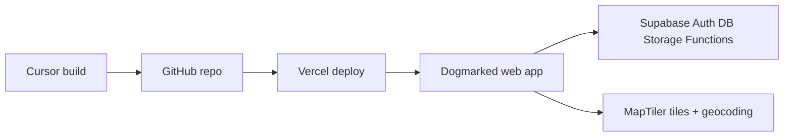
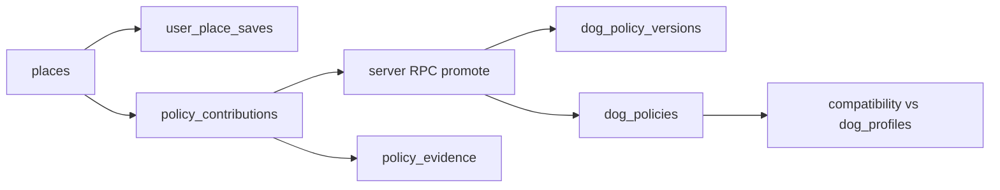

# Dogmarked — Master Build Plan

**Working product name:** Dogmarked  
**Former codename:** Operation Dog Friendly (retired for product/brand language)

This file is the **architecture + acceptance** source for Dogmarked. Day-to-day phase progress is tracked in [`roadmap.md`](./roadmap.md). Use the phase checklists below for detailed scope; keep `roadmap.md` status symbols current as work ships.

---

## Product promise (simplified MVP — current focus)

> Find a place, save it, tag it, and see it on your map.

Dogmarked is a **personal location map** (apartment-finder / travel-planning energy):

1. Find hotels, restaurants, beaches, parks, and other places (search or map tap).
2. Save as **Want to go** or **Been there**, with optional note and dog-access badges.
3. Choose **Private** or **Visible to others**.
4. Toggle an overlay of **other people’s public pins** on the same map.

**Not in MVP UI:** Community feed, collections, policy confidence, compatibility scores, affiliates, follow graphs, advanced filters, moderation consoles as primary destinations.

**Foundation separation (still true for deferred trust work):**  
Location → personal save → (later) public contribution → (later) trusted canonical policy

---

## Future backlog (deferred from MVP)

These may return later; keep tables/APIs if harmless, but they must not appear in primary navigation:

- Community destination, curated maps, follow users/collections
- Canonical policy engine, confidence %, compatibility verdicts, moderation queues
- Affiliate booking CTAs and partner reporting surfaces
- Trip planning, gamification, alerts, algorithmic discovery
- Full policy contribution / evidence workflows as the default path

---

## Infrastructure stack (all required)

| Service | Purpose |
|---|---|
| **Git + GitHub** | Version control, source of truth, branches, rollback, connection to Vercel |
| **Vercel** | Hosting, production deployment, preview deployments per branch/PR |
| **Supabase** | PostgreSQL + PostGIS, Auth, Storage, Edge Functions |
| **MapTiler** | Vector map tiles + interactive place search / autocomplete / reverse geocoding |



- **Cursor** is where we build.
- **GitHub** stores the application and migrations.
- **Vercel** auto-deploys from Git (production from `main`; preview per branch/PR).
- The deployed app connects to **Supabase** and **MapTiler** via environment variables.

### User-controlled setup checkpoints

Cursor scaffolds and configures code, but **cannot safely invent accounts, repositories, projects, or credentials**.

Phase 0 **pauses** and requests from the user:

| Checkpoint | User provides |
|---|---|
| GitHub repository creation or authorization | Repo URL / confirm `gh` auth |
| Vercel account/team and repository connection | Team/project link or confirm CLI login |
| Supabase organization and project creation | Project URL + publishable key (and service role via secure env only) |
| MapTiler account and API key | Public MapTiler key for `NEXT_PUBLIC_MAPTILER_KEY` |
| Production domain when available | Exact production URL for auth redirects |

**Rules:** Pause at external-account checkpoints and request the required project reference, URL, or public key. **Never fabricate credentials, expose secrets in logs, or commit them to Git.**

### Repository layout

```text
dogmarked/
├── src/
├── public/
├── supabase/
│   ├── config.toml
│   ├── migrations/
│   ├── functions/
│   └── seed.sql
├── tests/
├── docs/
│   └── master-build-plan.md
├── .env.example
├── .gitignore
├── package.json
└── README.md
```

`supabase/` is intended for version control (CLI local workflow + versioned migrations). Never make undocumented schema changes only in the dashboard.

### Commit vs do not commit

**Commit:** app source, UI, SQL migrations, RLS policies, Edge Functions, seed fixtures, tests, docs (including this master plan), `.env.example`, `.gitignore`.

**Do not commit:** API secrets, service-role keys, production credentials, `.env.local`, private user data, `node_modules`, `.next` / build output.

### Environment variables (names only)

```bash
NEXT_PUBLIC_SUPABASE_URL=
NEXT_PUBLIC_SUPABASE_PUBLISHABLE_KEY=
SUPABASE_SERVICE_ROLE_KEY=
NEXT_PUBLIC_MAPTILER_KEY=
NEXT_PUBLIC_APP_URL=
```

- `SUPABASE_SERVICE_ROLE_KEY` — **server-side only**; never in browser bundles.
- `.env.local` stays out of Git.
- Vercel holds separate values for Development / Preview / Production.

### Environment topology

| Environment | App | Data |
|---|---|---|
| **Local** | Cursor + `next dev`; optional local Supabase via CLI | Local or shared dev Supabase |
| **Preview** | Vercel branch/PR deployments | Development Supabase project |
| **Production** | Vercel `main` | Production Supabase project (own DB + secrets before real users) |

Start with one hosted **development** Supabase project if needed; split production DB/secrets before accepting real users.

### Auth redirect configuration (Phase 0)

Supabase Auth redirect allow-list:

- Exact localhost redirect (e.g. `http://localhost:3000/auth/callback`)
- Wildcard Vercel preview redirect (e.g. `https://*-<team>.vercel.app/auth/callback`)
- Exact production redirect when domain is available

App must implement:

- Authentication callback route (`/auth/callback`)
- Post-login return-path handling (safe relative redirect after session exchange)

PostGIS enables indexed bbox and radius queries (“places in this map area”, “within five miles of me”).

---

## Architectural pillars (non-negotiable)

| Concept | Entity | Purpose |
|---|---|---|
| Place identity | `places` | Where it is (name, geometry, category, address) |
| Personal save | `user_place_saves` | My relationship to a place (status, private notes, save visibility) |
| Public contribution | `policy_contributions` | Submitted dog-policy observation/claim (draft → review → published/rejected) |
| Canonical policy | `dog_policies` + `dog_policy_versions` | Current trusted summary + history |



**Saving privately does not publish.** Clients submit `policy_contributions` only. **Canonical promotion is server-only** (protected RPC / Edge Function / service-role path). Clients cannot directly write `dog_policies` or `dog_policy_versions`.

### Write authority

| Table | User client | Protected server |
|---|---|---|
| `user_place_saves` | Yes, own rows | Yes |
| `policy_contributions` | Submit own drafts | Moderate / publish workflow |
| `dog_policies` | Read only | Write |
| `dog_policy_versions` | Read only | Append |
| `audit_events` | No | Append |

---

## Locked application stack

- **App:** Next.js (App Router) + TypeScript + Tailwind + shadcn/ui
- **Map tiles:** MapLibre GL JS + MapTiler vector tiles (not OSM public tile servers)
- **Geocoding (behind adapter):** MapTiler Geocoding API for interactive search and location selection
  - **Before production:** verify the selected MapTiler plan permits permanent storage of each returned field we intend to keep
  - Store **user-supplied, curated, open-data, or otherwise licensed** canonical place data; retain source and attribution metadata
  - Keep the geocoding provider behind an **adapter interface** so it can be swapped without rewriting `places`
  - Do not use provider feature IDs as stable permanent FKs
  - Do not server-side cache/redistribute map tiles
- **Backend / auth / storage / functions:** Supabase
- **Hosting:** Vercel

---

## Data model (refined)

### `places`
Identity only: name, slug, category, PostGIS point, country_code, structured address, website/phone when allowed, status (`active` / `closed` / `duplicate_merged`), `duplicate_of_place_id`, source/attribution metadata, created_by, timestamps.

### `user_place_saves`
Personal library only: status (`want_to_go` / `visited` / `recommended`), save `visibility` (`private` / `link` / `public`), `private_notes`. **No policy payload.**

### `policy_contributions`
Structured policy snapshot, `exception_text`, source fields, `moderation_status` (`draft` / `in_review` / `published` / `rejected`).

### `dog_policies` + `dog_policy_versions`
Canonical current row + append-only history. Written only via protected server promotion path.

### Supporting
`policy_evidence`, `place_photos` (licensing fields), `dog_profiles`, `user_verifications`, `policy_reports`, `collections` (Phase 3+), `follows`, `profiles`, `import_sources`, `audit_events`, `affiliate_links` (Phase 8).

### Policy field groups
Status · access (multi) · restrictions (incl. max dogs, individual/combined weight) · cost + **currency** · dedicated **exception** · proof/source.

### Units / i18n hooks
Weights stored in **kg**; display kg/lb by preference. ISO 4217 currencies. Locale dates. Address by `country_code`. Service-animal terminology by country.

### Image licensing
Every image: `source_type`, `source_url`, `attribution_text`, `license`, `storage_permission` (`allowed_permanent` / `link_only` / `unknown`). Placeholder fallback — never assume provider images are storable.

### Confidence
Business / official / multi-community / single / OSM / unverified / stale. **Affiliates never affect confidence.**

---

## Worldwide, moderation, UX (summary)

- Worldwide-ready schema from the start (FR, SE, CH, IT, US+); content may start in South Florida.
- Moderation/duplicates from first publish path: proximity+name dedupe, contribution states, reports, conflict → new version via server promote, closed places, `audit_events`.
- Mobile nav: Explore · My Places · Add · Community · Profile. Desktop ≥1280: left results + map + right detail (sheet below).
- URL state for explore/place/collections. Dog-first place detail hierarchy.
- Mobile-web: PWA readiness, safe areas, 44px targets, sheet+keyboard, geolocation states, list as accessible map alternative, breakpoints 375 / 768 / 1024 / 1280 / 1440.
- Design: coastal daylight, Dogmarked brand on first viewport, map as hero, calm chrome (not Mapstr-crowded).

---

## Phase plan

### Phase 0 — Repository and infrastructure

Complete before product UI work depends on deployed backends. **Pause at every external-account checkpoint.** Phase 0 work will be implemented in code against this checklist.

- [x] Scaffold Next.js (App Router) + TypeScript + Tailwind + shadcn/ui in this workspace
- [x] Add `.gitignore`, `.env.example`, `README.md`
- [ ] **Checkpoint:** GitHub repository creation or authorization — request repo URL / `gh` auth from user
- [ ] Push scaffold to GitHub (only after user confirms repo)
- [ ] **Checkpoint:** Vercel account/team + connect repository — request confirmation / project link
- [ ] **Checkpoint:** Supabase org + project — request project URL and keys via secure env entry
- [x] Initialize Supabase CLI (`supabase/config.toml`)
- [x] Enable PostGIS via versioned migration
- [x] Add migration/seed scaffolding
- [x] Configure local / preview / production env slots on Vercel (names only in docs)
- [ ] Auth redirects: exact localhost · wildcard Vercel preview · exact production (when domain available) — *code ready; configure in Supabase dashboard after project exists*
- [x] Implement `/auth/callback` + post-login return-path handling
- [ ] **Checkpoint:** MapTiler account + API key — request public key
- [x] Wire MapTiler behind geocoding adapter stub + basemap smoke test
- [x] Document env var names in `.env.example` and README
- [ ] **Checkpoint:** production domain when available
- [ ] Verify first Vercel preview deployment
- [ ] Verify database connectivity from deployed app (health check)
- [x] Write `docs/master-build-plan.md`

**Phase 0 done when:** preview URL loads scaffold, Supabase connectivity verified, auth redirect patterns configured, MapTiler key wired for smoke test, no secrets in Git.

### Phase 1 — Vertical slice (first product release)

Validate the full core loop before collections, following, or bulk imports. Phase 1 work will be implemented in code against this checklist.

- [x] MapLibre + MapTiler basemap; Explore responsive map + list
- [x] Schema + RLS: `places`, `user_place_saves`, `policy_contributions`, `dog_policies`, `dog_policy_versions`, `dog_profiles`, image licensing fields, `audit_events`
- [x] Curated South Florida seed fixtures (licensed/placeholder images)
- [x] Place detail (dog-first hierarchy)
- [x] Auth + **private save** (`user_place_saves` own-row writes)
- [x] Submit one `policy_contributions` draft/publish path
- [x] **Promote to canonical policy via protected server-side function/RPC only** — clients cannot write `dog_policies` / `dog_policy_versions`
- [x] Source + last verified on listing
- [x] Basic Sugar & Munch profiles + compatibility (Good match / Ask first / Not a match / Unknown)
- [x] Geocoding adapter for add-by-search → our `places` (with source/attribution; storage rights verified before production field retention)
- [x] Basic duplicate check + contribution draft/published states
- [x] Mobile safe areas, touch targets, list as map alternative
- [x] **RLS tests** (see below)

**Out of Phase 1:** collections, follow graph, Community depth, OSM import, affiliates, full i18n pack.

#### Phase 1 RLS tests (required)

- [x] Anonymous, authenticated, contributor, and moderator permission matrices
- [x] Users cannot read another user’s private saves
- [x] Users cannot modify canonical policies (`dog_policies` / `dog_policy_versions`)
- [x] Service-role operations only execute server-side
- [x] Public listings expose no private notes or unpublished evidence

### Phase 2 — Map foundation hardening

- [x] Full URL state for map/filters/selection
- [x] Clustering polish, search-this-area, category + policy + layer filters
- [x] Desktop left/right panels; tablet drawers
- [x] PWA manifest/SW baseline; geolocation permission states
- [ ] Breakpoint QA signed off

### Phase 3 — Personal map depth

- [x] Want / visited / recommended workflows
- [x] Collections + shareable collection URLs
- [x] Link visibility for saves/collections
- [x] Add by address / map pin / current location / coordinates
- [x] Public profile shell (`/@handle` via `/u/[handle]`)

### Phase 4 — Policy intelligence and trust

- [x] Full policy form
- [x] Official policy vs known exception UX
- [x] Evidence photos with licensing checks *(link-only + permanent upload via `/api/evidence/upload`)*
- [x] Confirmations + report incorrect
- [x] Conflict resolution + version history UI (server-side promote only)
- [x] Moderation queue + audit log
- [x] Closed-place handling
- [x] Permanent photo storage bucket *(migration 010 `place-photos` applied)*

### Phase 5 — Matching and worldwide UX

- [x] Multi-dog + combined weight + carrier edge cases
- [x] kg/lb, currency display, locale dates
- [x] i18n framework + EN strings extracted
- [x] Country address formatting + service-animal copy variants
- [x] Seasonal policy display

### Phase 6 — Community discovery

- [x] Follow users and collections
- [x] Community tab surfaces
- [x] Contribution history on profiles
- [x] No algorithmic For You feed

### Phase 7 — Data enrichment

- [x] South Florida OSM import with imported provenance
- [x] Scale duplicate matching + merge tooling *(`/admin/merges` + migration 009 applied)*
- [x] Import admin
- [x] Licensed place-provider enrichment hooks *(schema/types; provider attach pending)*
- [x] Business claim stub *(`/admin/claims` + migration 011 applied)*
- [ ] Confirm MapTiler (or successor) plan storage rights for any retained geocode fields before production scale

### Phase 8 — Monetization

- [x] Affiliate links, booking CTAs, disclosure, click attribution *(hop via `/api/affiliates/click`)*
- [x] Partner reporting *(`/admin/partners` + migration 008 applied)*
- [x] Promoted placements visually separated
- [x] Confidence scoring ignores affiliate data

### Phase 9 — Map-first product refinement

Make Explore feel like a polished, location-driven travel product (map primary). **Critical rule:** restaurants/hotels/etc. on the basemap are **neutral contextual places** — never dog-friendly until Dogmarked has policy evidence. Never infer friendliness from POI presence.

#### Repair
- [x] Fix `policy_contributions` insert path (profile ensure + RLS); drafts own-row only; no client writes to `dog_policies` / versions / audit *(migration 012 applied)*
- [x] Helpful API/UI errors (no raw DB/RLS strings in UI)
- [x] Place routes + disable links without canonical place *(Hale Pâtisserie seed + not-found)*
- [x] Desktop detail panel XOR mobile bottom sheet *(≥1280 panel / &lt;1280 sheet)*
- [x] Auth UI: no dual Sign in / Sign out; product language (“Save changes”)
- [x] Sugar & Munch seed weights (~2.3 kg / 5 lb, small, carrier) + profile load/save states

#### Map intelligence
- [x] MapTiler streets + POI click via `queryRenderedFeatures`
- [x] Layers A basemap · B neutral contextual POIs · C Dogmarked policy pins *(status colors; progressive label opacity)*
- [x] `PlaceProvider` interface; MapTiler impl; Foursquare stub (FSQ OS Places next)
- [x] `external_place_refs` (migration 012)
- [x] Unified map click (“What’s here?”) + Explore search + “Search this area”

#### Shell + design
- [x] Desktop 64px header + UserAvatarMenu; Saved → My Places
- [x] Mobile bottom nav + safe areas; breakpoint layouts (1280 / 768)
- [x] Design tokens + Manrope + shared place content + showcase route *(`/design-system`)*

**Deferred / polish:** tablet drawer chrome polish; persist `external_place_refs` on contribute; FSQ OS Places live key; breakpoint QA sign-off; MapTiler storage-rights confirmation.

**Credentials needed:** existing `NEXT_PUBLIC_MAPTILER_KEY` for POI search (optional `FOURSQUARE_API_KEY` later).

**Phase 9 done when:** map feels populated via basemap POIs (not only seed pins); neutral ≠ dog friendly; desktop/mobile distinct nav & detail; RLS + place routes + auth + Sugar/Munch fixed; tokens used where UI is touched.

### Phase 10 — Simplify and refocus MVP *(active)*

Primary loop only: find → save → tag → map.

- [x] Remove Community / equal-weight nav from primary chrome; map is the app
- [x] Compact header: wordmark, search, My places / Other people, avatar
- [x] Map/List toggle; floating Add a place
- [x] Around here: map click → reverse + nearby candidates → custom place
- [x] Place composer over map (category, status, dog badges, note, visibility)
- [x] Preview drawer/sheet (XOR desktop/mobile)
- [x] Migration **014** — `dog_badges`, `been_there`, public overlay RPC, categories
- [ ] Apply migration 014 on hosted Supabase
- [ ] Breakpoint QA + empty-state polish
- [ ] Provider images / Wikimedia when rights allow (placeholders OK for now)

---

## Populate safely

- No scraping/storing Google / Mapstr / BringFido / Yelp dog directories against their terms
- Phase 1: curated fixtures + user contributions
- Phase 7: OSM tags as medium-confidence imports
- Every image must justify storage permission or remain link/placeholder only
- Geocoding provider remains swappable via adapter

---

## Acceptance criteria

**Phase 0:** User checkpoints completed without fabricated secrets; GitHub ↔ Vercel preview works; Supabase reachable; PostGIS via migration; auth redirects (localhost + preview wildcard + production when ready) + callback/return-path; MapTiler key wired; env docs complete; secrets not in Git.

**Phase 1:** South Florida pins + list; place verdict/source/verified; private save without publishing; contribution submit + **server-only** canonical promote; Sugar & Munch compatibility (Ask first when max dogs = 1); RLS test suite green.

---

## Definition of done (through Phase 7)

Infrastructure reproducible from the repo; personal saves ≠ public contributions; versioned canonical policies writable only server-side; pack compatibility; moderation/duplicates; honest image/geocode licensing; South Florida OSM seed with provenance; Dogmarked brand throughout — not a bookmarking clone or generic review site.

## Build order (summary)

1. Establish reproducible infrastructure (with user checkpoints)
2. Prove the complete Dogmarked core loop
3. Harden the map experience
4. Expand personal organization
5. Deepen trust and moderation
6. Add worldwide matching
7. Grow community and imported coverage
8. Monetize only after trust is established
